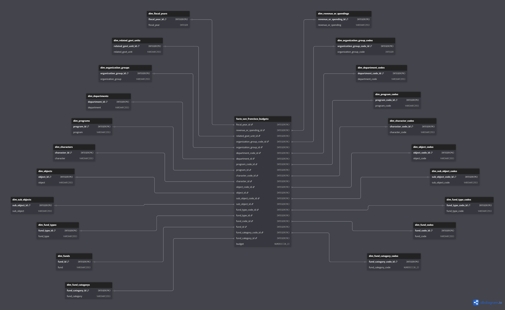

# San Francisco Budgets Data Pipeline  

  

A modular ETL pipeline for processing and analyzing San Francisco's budget data from the [San Francisco Open Data APIs](https://datasf.org/opendata/), with Snowflake as the target data warehouse.

## 📌 Features
- **Batch Processing**: Manually executing data using data ingestion processes from [SF Open Data Portal](https://data.sfgov.org/)
- **Snowflake Integration**: Optimized for cloud data warehousing
- **Reproducible Workflows**: Version-controlled transformations with different phases

## 🛠️ Pipeline Architecture  

### Data Sources
- Primary API: [SF Budget Datasets](https://data.sfgov.org/City-Management-and-Ethics/Budget/xdgd-c79v)

### Data Schema


### Core Components
| Component               | Purpose                                                                      | Documentation |
|-------------------------|------------------------------------------------------------------------------|---------------|
| **Requests**            | Fetches raw data from [SF Open Data APIs](https://dev.socrata.com/foundry/data.sfgov.org) | [Docs](https://requests.readthedocs.io/) |
| **Pandas**              | Performs data cleaning and transformation                                    | [Docs](https://pandas.pydata.org/docs/) |
| **Snowflake Connector** | Handles secure data loading to Snowflake                                     | [Docs](https://docs.snowflake.com/en/user-guide/python-connector.html) |
| **SQL Alchemy**         | Initializing engine for SQL Queries to Snowflake Data Warehouse              | [Docs](https://docs.sqlalchemy.org/en/20/intro.html) |
| **Snowflake SQL Alchemy** | Creating URL for converting SQL Alchemy engine parameters to URL           | [Docs](https://docs.snowflake.com/en/developer-guide/python-connector/sqlalchemy) |

## 🔄 Workflow Overview
1. **Ingest**
   - Raw API data → `data/raw/` (CSV/JSON)
   - Ingested using [Request Module](https://requests.readthedocs.io/)
   - Paginated for faster processing

1. **Extract**  
   - `data/raw/` → `data/staged`
   - Extracted using [Pandas](https://pandas.pydata.org/docs/)

2. **Transform**  
   - `data/staged`→ `data/processed/` (structured tables)
   - Business logic application
   - Different transformation phases such as (`Data Imputation`, `DataType Casting`, `Format Revisioning`, `Data Partitioning`, `Data Integration`, and `Data Deduplication`)

3. **Load**
   - Perform data schema revisioning before loading to temporary stage of Snowflake
   - `data/processed` → `@processed_datasets`
   - Load datasets from temporary stage to corresponding tables

4. **Testing SQL Queries**
   - Performing SQL Queries using SQL Alchemy Engine

## 🚀 Getting Started

### Prerequisites

#### System Requirements
- Python 3.8 or higher
- pip package manager
- Git version control

#### Accounts & Credentials
- Active Snowflake account with:
  - Warehouse privileges
  - Database create/modify permissions
  - Stage access
- Access to [SF Open Data Portal](https://data.sfgov.org/) (no account needed)

### Installation

1. **Create virtual environment (recommended):**
   ```
      python -m venv venv
      source venv/bin/activate  # On Windows use `venv\Scripts\activate`
   ```

2. **Activate Virtual Environment**:
   ```
      python .venv/Scripts/Activate
   ```

3. **Install required Python packages:**
   ```
   pip install requests pandas snowflake-connector-python sqlalchemy snowflake-sqlalchemy
   ```

4. **Verify Installations:**
   ```
   python -c "import requests, pandas, snowflake.connector, sqlalchemy; print('All packages installed successfully')"
   ```

### Execution of Data Pipeline

**Execution of San Francisco Budget Data Pipeline**
```
   py etl/logs/logs.py
```